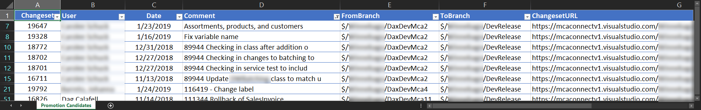

# Azure DevOps Get-DevOpsCandidates
This Cmdlet determines what changesets are candidates for merging/promotion/pushing.

## One-Time Setup Instructions

1) Find and replace all "DevOpsProject" with the name of the project on which you are working.

2) In order to make sure TF.exe knows which collection to query, run this and authenticate to Azure DevOps:
    `"C:\Program Files (x86)\Microsoft Visual Studio\2017\Enterprise\Common7\IDE\CommonExtensions\Microsoft\TeamFoundation\Team Explorer\TF.exe" workspaces /collection:https://dev.azure.com/MyOrganization`

After authenticating, you should get this back:

    Collection: https://dev.azure.com/MyOrganization/
    Workspace Owner        Computer  Comment
    --------- ------------ --------- ---------------------------------------
    MCADAG-02 Dag Calafell MCADAG-02


## Usage

### Import this function

```powershell
. '.\Azure DevOps Source Control.ps1'
```

### Example 1: Get candidates to promote from one branch to another
```powershell
Get-DevOpsCandidates "$/DevOpsProject/Dev1" "$/DevOpsProject/Trunk"
```

### Example 2: Save output as CSV
This is where the command saves you time!

```powershell
[string[]]$devBranches = "$/DevOpsProject/dev1", "$/DevOpsProject/dev2", "$/DevOpsProject/dev3", "$/DevOpsProject/dev4", "$/DevOpsProject/dev5", "$/DevOpsProject/dev6", "$/DevOpsProject/dev7", "$/DevOpsProject/dev8", "$/DevOpsProject/dev9", "$/DevOpsProject/dev10", "$/DevOpsProject/dev11", "$/DevOpsProject/dev12"
[string]$promoteToBranch = "$/DevOpsProject/Trunk"

$CandidateChangeSets = Get-DevOpsCandidates $devBranches $promoteToBranch
$CandidateChangeSets | Format-Table *
$CandidateChangeSets | Export-Csv -NoTypeInformation -Path "$env:USERPROFILE\Desktop\Promotion Candidates for Trunk.csv"
```



